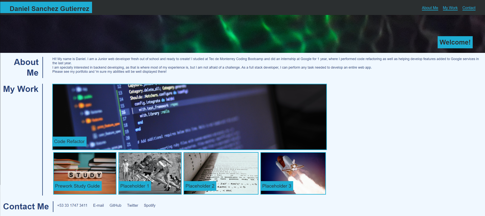

# Code Refactor Starter Code

## Description
This project was created in order to create a personal portfolio, with the intention of using it as a template and upgrading it with time. The goal of the project is to practice with advanced CSS elements to make a wepage more interactive.

Inside the docs folder is the HTML and CSS file. In this README file, you will find the link to the deployed app.

## Usage
Inside the app, there are items the user can interact with. In the header, you can click on the section in order to navigate to a specific section inside the webpage.

Inside the "My Work" section, the user can interact with the elements by hovering the mouse over the images, as well as clicking on any project to navigate to said deployed application.

Inside the "Contact me" section, the user can select any of the link in order to navigate to the webpage listed.

## Mock-Up

--- 

## Credits

- Code by: Daniel Sanchez (https://github.com/Morkendi)
- Code assistance bt: Marco Monter (Bootcamp TA)

## Links
- Link to GitHub Pages: 